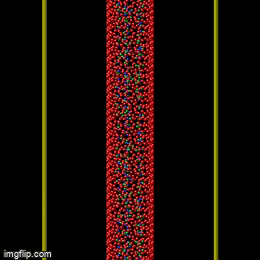
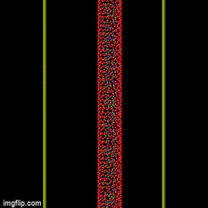

# Supervised Learning to Predict the Relaxation Time of Water confined in Nanotubes
  
## Authors
Jose Cobena (cobenare@usc.edu) - PhD CHE  
Spencer Ortega (sportega@usc.edu) - MS CS 

## Abstract
Molecular dynamics (MD) simulations are typically used to study systems that are difficult to analyze in experiments. One MD system that has gained the attention of researchers in recent years is the study of confined water in Nanotubes (NT). Among the properties that can be computed to characterize such a system is the relaxation time. The Intermediate scattering function (ISF), which is directly correlated to the structural relaxation time, can be computed directly from the trajectory obtained from MD by fitting the ISF curves to the Kohlrausch–Williams–Watts (KWW) function. The advantage of MD data over scattering experiments is the access to very low wavenumbers that are usually inaccessible in experiments. However, to cover the whole range of time required to plot the ISF, long simulations (40 ns) are required. Here, we attempt to predict the relaxation time of confined water in NTs by computing the ISF for multiple NTs, all varying by features that globally describe the system (tube material, tube diameter, temperature), and feeding this labeled data to some supervised learning algorithm. 

## Methodology and Results

#### 1. Create and fill NT structures
The first step to our project was to create a NT given a material type (C, SiC, BN, and MoS) and tube diameter, and store in the format of a PDB and LAMMPS data file. Our initial goal was to create our NTs using only open-source software, as opposed to spending thousands of dollars on a software license. We found a hacky solution to this problem by first creating a PDB of a NT using [VMD](https://www.ks.uiuc.edu/Research/vmd/)'s NT builder and importing/exporting this PDB into [Chimera](http://www.cgl.ucsf.edu/chimera/about.html) to create the connections of the NT atoms. Our NT was now ready to be filled up with water.  

In order to properly fill the NT, we had to figure out a way to optimally place the water atoms in the tube. Prior to the start of this project, our team member Jose had already created a python script to accomplish this. The only issue with his script was all NT variables were hard coded and it had tons of I/O redundancy. We generalized his code by allowing the user to enter the NT parameters as arguments to the program and simplified the I/O operations. At this point we believed that we had successfully created and filled these NTs.  

#### 2. Choose and validate force fields
Force fields (FF) in MD are usually designed to model a specific system and usually are tested to predict one or more properties of that system. Models for Carbon NT + water systems are abundant; however, that is not the case for the other NTs which will require validation. Among the water models, the [TIP4P](https://lammps.sandia.gov/doc/Howto_tip4p.html) family are widely used due to its accuracy.  

We initially decided to use the TIP4P/2005 model with the NT positions fixed, which would accelerate our simulation by accounting for less atoms. After multiple attempts of trying this method out we noticed that water atoms were interacting very strangely. Due to these results we assumed it was the doing of the model and fixed positions. We then proceeded to simultaneously test out the TIP4P/Ew model with rebo, where the NT atoms are moving and interacting with the water atoms as well. In order to make sure the NT wouldn't move during the simulation we had to set multiple NT atoms as anchors (fixed position). After testing this model out we noticed that the results were very similar to the previous one.  

Since the results from both FFs were insufficient, we had a hunch that the issue had to be related to our NT structures, as opposed to the system. The only way to prove this hypothesis was to run our simulation on a NT that was created using some other software. Luckily Jose had a NT PDB that he had created using [Material Studios](https://www.3dsbiovia.com/products/collaborative-science/biovia-materials-studio/), which is one of those expensive licensed softwares. We ran both FFs on this tube separately and after further investigation of the results we noticed that it was finally working, confirming that our method of creating NTs via open-source software was incorrect. With our project deadline approaching we decided to move forward testing our MD system with this new NT and our original TIP4P/2005 model.

###### VMD vs. Material Studios
 &nbsp;&nbsp;&nbsp;&nbsp;&nbsp;   
Here are the visualizations we captured while we were computing our simulations. You can clearly see that the water in the VMD NT (left) is bunching up and seperating into two groups. The Material Studios NT (right) on the other hand seems to have an even disrtibution of water.
        
#### 3. Simulate confined water in NT
We used [LAMMPS](https://lammps.sandia.gov/) for all of our MD simulations. Before we could run our full simulation of confined water in some NT, we had to first thermalize our NT and water. Once we obtain the thermalized positions of the atoms for this specific NT, we could then use them to run multiple simulations with different temperatures. In order to accomplish this goal and streamline our work, we decided to create multiple bash and python scripts that set up directory hierarchies and automate slurm submissions on USC-HPC. More information about these scripts can be found in the README of the "spencer" directory.  

## Future Work

#### 1. Make VMD/Chimera work
In order to accomplish our goal of using machine learning to predict the relaxation time of these NTs, we need to figure out how to fix our VMD/Chimera method so that we could correctly create NTs and successfully simulate them in our system. Of course we could purchase a licensed software to solve this problem, but as students we would like to make our work reproducible for anyone, despite their resources.  

#### 2. Compute relaxation time
During the duration of our project we were only able to reach the point of successfully testing our confined water simulations. The next step would be to use the trajectory files that LAMMPS produces during these simulations to compute the relaxation time via KWW function. We would of course have to do this for every NT simulation.  

#### 3. Train and test ML
Once we finally have a sufficient amount of labeled data, we could then attempt to use some supervised learning algorithm to build a model that can predict relaxation times given a feature vector. This vector would consist of the NT material type, diameter, and system temperature. It's hard to say at this moment which learning algorithm would work proficiently with this dataset because we have not collected enough to test. I would initially try more simple algorithms such as linear regression, knn, decision trees, etc. and gradually move toward more fancy algorithms such as Neural Networks.  

## References
[1] Cobena-Reyes, J., Kalia, R. K., & Sahimi, M. (2018). Complex behavior of ordered and icelike water in carbon nanotubes near its bulk boiling point. The journal of physical chemistry letters, 9(16), 4746-4752.
